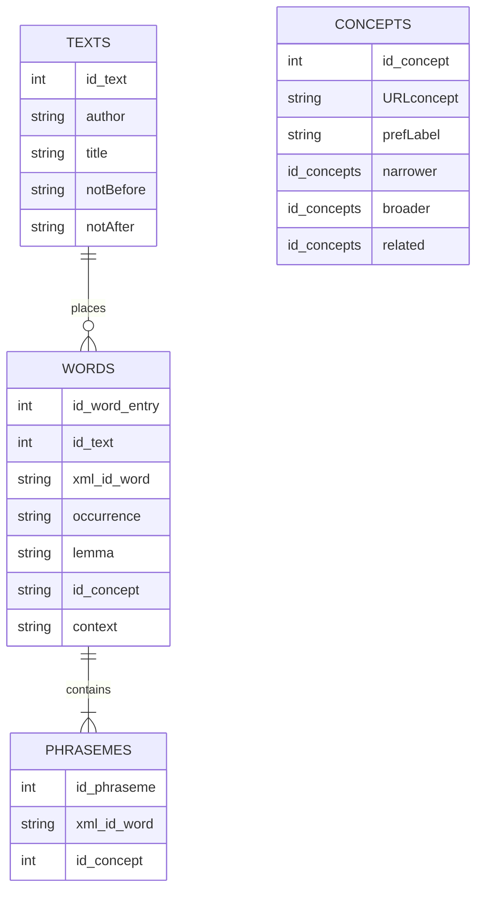

The application reads `.tei.xml` files in a folder and generate using SQLalchemy a SQLite database.


Inside the `teiHeader` of each of the `.tei.xml` file we have the following fields:
```xml
<teiHeader>
    <fileDesc>
      <titleStmt>
        <title>Rime</title>
        <author>Pietro Bembo</author>
        <editor resp="encoder">Joe Foe</editor>
        </respStmt>
      </titleStmt>
      <sourceDesc>
          <history>
            <origin>
              <origDate notBefore="1469-11-12" notAfter="1500-10-30">
                Between 12 November 1469 and 30 October 1500
              </origDate>
            </origin>
          </history>
        </msDesc>
        <bibl>
          <title>Rime</title>
          <author>Pietro Bembo</author>
          <date when="1999">1999</date>
          <note>Edition used as base text for encoding.</note>
        </bibl>
      </sourceDesc>
    </fileDesc>
  </teiHeader>
```

The script extracts `author`, `title`, `notBefore`, `notAfter`. And build a the table TEXTS of the DB with those fields and an incremental id for the text.

The TEI `<body>` of each file contain:

```xml
<p>
Ha la lingua un'altra sorte di versi, in tutto simili a questi 
    <w lemma="intero" xml:id="01_01_00" ana="https://dismi/intero">interi</w> di cui s'è detto.</s>
    <s n="2">Se non che hanno nel <w lemma="fine" xml:id="01_02_00" ana="https://dismi/fine">fine</w> una <w lemma="sillaba" xml:id="01_03_00" ana="https://dismi/sillaba">sillaba</w> di più, 
    la qual
  </p>
```

The script extract all the `<w>` tags and populate the table WORDS and the table CONCEPTS with the following entry:
`id_word_entry` : an incremental ID of the word.
`id_text` : the `id` of the text where the word is extracted
`xml_id_word` : is the `xml:id` attribute of `<w>`.
`occurrence` : is the text between `<w>` and `<\w>`.
`lemma` : is the `lemma` attribute of `<w>`.
`id_concept` : is the `id` of the concept in the CONCEPTS table
`context` : contains the 25 words before and after `<w>`.

The CONCEPT table will contain `URLconcept` from `ana` attribute of `<w>` and an incremental id `id_concept` that will be used by WORDS.

The table PHRASAMES contains data extracted from `<span>` elements of TEI text with `type=baseForm`, as in the following example:

```xml
Nel caso che i <w xml:id="l3_0"> versi </w> sien infine <w xml:id="
l3_1"> rotti </w> , l’autore non dovrà mai lasciarli in balia
del lettore .
2 <span type="baseForm" ana="https://dismi/enjambement" target="#l3_1 #l3_0" n="versi rotti"/ >
```

Each row of the table PHRASAMES will contain an incremental id, and link to the words making up the phraseme, using the `xml:id` listed on the `target` attribute of `span` that correspond to the `xml_id_word` of the WORDS table (note `target` attribute contains the ID separated by a space and with a # suffix). While the `n` attribute will be used to write a normalized form of the phraseme called `normalized_form` in the table.
`


