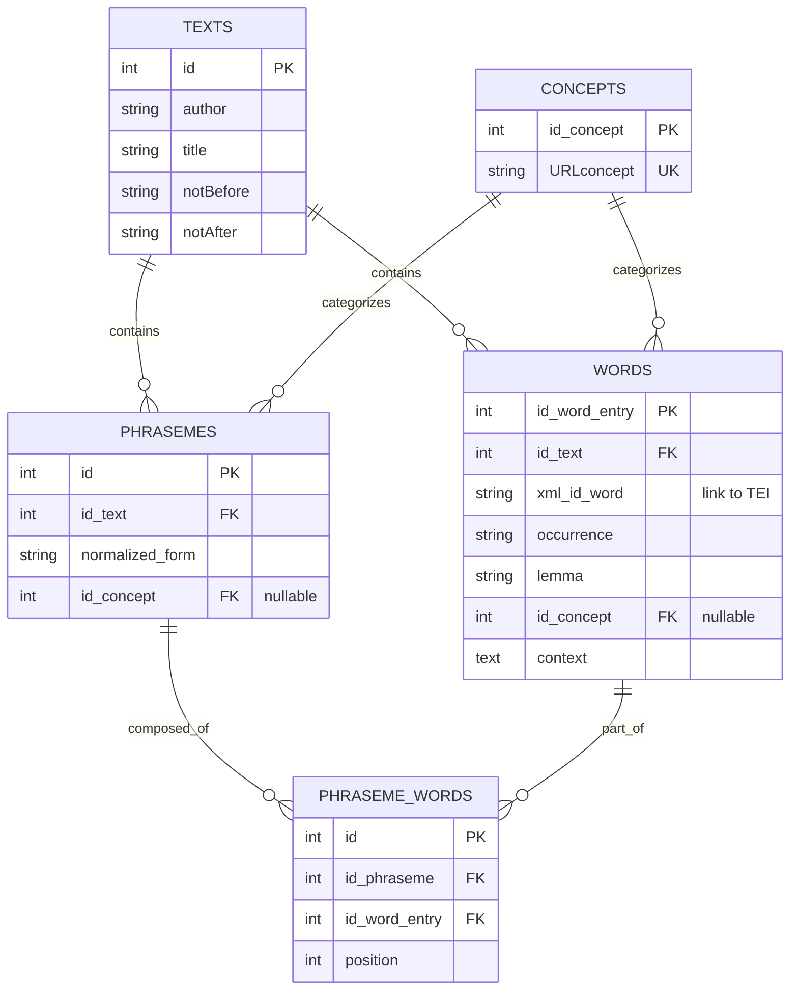

The application reads `.tei.xml` files in a folder and generates using SQLAlchemy a SQLite database.

Inside the `teiHeader` of each `.tei.xml` file we have the following fields:
```xml
<teiHeader>
    <fileDesc>
      <titleStmt>
        <title>Rime</title>
        <author>Pietro Bembo</author>
        <editor resp="encoder">Joe Foe</editor>
        </respStmt>
      </titleStmt>
      <sourceDesc>
          <history>
            <origin>
              <origDate notBefore="1469-11-12" notAfter="1500-10-30">
                Between 12 November 1469 and 30 October 1500
              </origDate>
            </origin>
          </history>
        </msDesc>
        <bibl>
          <title>Rime</title>
          <author>Pietro Bembo</author>
          <date when="1999">1999</date>
          <note>Edition used as base text for encoding.</note>
        </bibl>
      </sourceDesc>
    </fileDesc>
  </teiHeader>
```

The script extracts `author`, `title`, `notBefore`, `notAfter` and builds the table TEXTS of the DB with those fields and an incremental id for the text.

The TEI `<body>` of each file contains:
```xml
<p>
Ha la lingua un'altra sorte di versi, in tutto simili a questi 
    <w lemma="intero" xml:id="01_01_00" ana="https://dismi/intero">interi</w> di cui s'è detto.</s>
    <s n="2">Se non che hanno nel <w lemma="fine" xml:id="01_02_00" ana="https://dismi/fine">fine</w> una <w lemma="sillaba" xml:id="01_03_00" ana="https://dismi/sillaba">sillaba</w> di più, 
    la qual
  </p>
```

The script extracts all the `<w>` tags and populates the table WORDS and the table CONCEPTS. The WORDS table contains:
- `id_word_entry`: an incremental ID of the word
- `id_text`: the `id` of the text where the word is extracted
- `xml_id_word`: the `xml:id` attribute of `<w>`
- `occurrence`: the text between `<w>` and `</w>`
- `lemma`: the `lemma` attribute of `<w>`
- `id_concept`: the `id` of the concept in the CONCEPTS table (nullable)
- `context`: contains the 25 words before and after `<w>`

The CONCEPTS table contains:
- `id_concept`: an incremental primary key
- `URLconcept`: the value from the `ana` attribute of `<w>` (unique)

The table PHRASEMES contains data extracted from `<span>` elements of TEI text with `type="baseForm"`, as in the following example:
```xml
Nel caso che i <w xml:id="l3_0">versi</w> sien infine <w xml:id="l3_1">rotti</w>, l'autore non dovrà mai lasciarli in balia del lettore.
<span type="baseForm" ana="https://dismi/enjambement" target="#l3_0 #l3_1" n="versi rotti"/>
```

The PHRASEMES table contains:
- `id`: an incremental primary key
- `id_text`: reference to the text
- `normalized_form`: the value from the `n` attribute of `<span>`
- `id_concept`: reference to CONCEPTS table (nullable)

The junction table PHRASEME_WORDS links phrasemes to their component words:
- `id`: incremental primary key
- `id_phraseme`: reference to PHRASEMES.id
- `id_word_entry`: reference to WORDS.id_word_entry (matched by `xml_id_word`)
- `position`: order of the word in the phraseme (1, 2, 3...)

The `target` attribute of `<span>` contains space-separated xml:id references with `#` prefix (e.g., "#l3_0 #l3_1"), which are matched to `xml_id_word` in the WORDS table to establish the relationships.



```mermaid
erDiagram
    TEXTS ||--o{ WORDS : "contains"
    TEXTS ||--o{ PHRASEMES : "contains"
    CONCEPTS ||--o{ WORDS : "categorizes"
    CONCEPTS ||--o{ PHRASEMES : "categorizes"
    PHRASEMES ||--o{ PHRASEME_WORDS : "composed_of"
    WORDS ||--o{ PHRASEME_WORDS : "part_of"
    
    TEXTS {
        int id PK
        string author
        string title
        string notBefore
        string notAfter
    }
    
    WORDS {
        int id_word_entry PK
        int id_text FK
        string xml_id_word "link to TEI"
        string occurrence
        string lemma
        int id_concept FK "nullable"
        text context
    }
    
    PHRASEMES {
        int id PK
        int id_text FK
        string normalized_form
        int id_concept FK "nullable"
    }
    
    PHRASEME_WORDS {
        int id PK
        int id_phraseme FK
        int id_word_entry FK
        int position
    }
    
    CONCEPTS {
        int id_concept PK
        string URLconcept UK
    }
```

## The Browser
The application is built using Flask. The database containing the texts is queried using SQLAlchemy through a REST API that returns results in JSON format.
API Endpoint
The main API endpoint for searching occurrences is:
GET /api/v1/occurrences
This endpoint performs unified search across words, phrasemes, and concepts, returning all matching occurrences in a single result set.
Query Parameters
Search Parameters

q (string, required): The search query. Can match:

Word lemmas (e.g., "verso")
Word occurrences (e.g., "versi")
Phraseme normalized forms (e.g., "versi rotti")
Concept URLs or IDs (e.g., "enjambement" or "https://dismi/enjambement")

type (string, optional, default: "all"): Limits the search to specific types:

"all" - searches words, phrasemes, and concepts
"word" - searches only words (by lemma or occurrence)
"phraseme" - searches only phrasemes (by normalized_form)
"concept" - searches by concept (returns both words and phrasemes with matching concept)


Filter Parameters

notBefore (string, ISO date format): Filters results to texts composed from this date onward. Compares against the notBefore column in the TEXTS table.
notAfter (string, ISO date format): Filters results to texts composed up to this date. Compares against the notAfter column in the TEXTS table.
text_id (string): Comma-separated list of text IDs to limit the search scope (e.g., "1,2,3"). If omitted, all texts are searched.

Pagination Parameters (Tabulator compatible)

page (integer, default: 1): Current page number
size (integer, default: 50): Number of results per page

JSON Response
The API returns a JSON object compatible with Tabulator's server-side pagination format:
json{
  "api_version": "v1",
  "last_page": 10,
  "current_page": 1,
  "per_page": 50,
  "total_results": 487,
  "data": [
    {
      "type": "word",
      "id": 123,
      "xml_id": "w_001_045",
      "occurrence": "versi",
      "lemma": "verso",
      "normalized_form": null,
      "concept": {
        "id": 5,
        "url": "https://dismi/verso"
      },
      "context": "Ha la lingua un'altra sorte di versi, in tutto simili...",
      "text": {
        "id": 2,
        "author": "Pietro Bembo",
        "title": "Rime",
        "notBefore": "1469-11-12",
        "notAfter": "1500-10-30"
      }
    },
    {
      "type": "phraseme",
      "id": 45,
      "xml_id": ["w_003_012", "w_003_013"],
      "occurrence": "versi rotti",
      "lemma": null,
      "normalized_form": "versi rotti",
      "concept": {
        "id": 12,
        "url": "https://dismi/enjambement"
      },
      "context": "Nel caso che i versi sien infine rotti, l'autore...",
      "text": {
        "id": 3,
        "author": "Torquato Tasso",
        "title": "Discorsi dell'arte poetica",
        "notBefore": "1587-01-01",
        "notAfter": "1587-12-31"
      }
    }
  ],
  "texts": [
    {
      "id": 2,
      "author": "Pietro Bembo",
      "title": "Rime",
      "notBefore": "1469-11-12",
      "notAfter": "1500-10-30"
    },
    {
      "id": 3,
      "author": "Torquato Tasso",
      "title": "Discorsi dell'arte poetica",
      "notBefore": "1587-01-01",
      "notAfter": "1587-12-31"
    }
  ]
}
```

## Response Fields

### Main Response Object

- **`api_version`**: API version identifier
- **`last_page`**: Total number of pages (required by Tabulator)
- **`current_page`**: Current page number
- **`per_page`**: Results per page
- **`total_results`**: Total number of matching results across all pages
- **`data`**: Array of occurrence objects
- **`texts`**: Array of unique text metadata for all results in current page

### Occurrence Object Fields

- **`type`**: Type of occurrence - `"word"` or `"phraseme"`
- **`id`**: Unique identifier (`id_word_entry` for words, `id` for phrasemes)
- **`xml_id`**: 
  - For words: string containing the `xml:id` from the TEI file
  - For phrasemes: array of strings containing all component word `xml:id` values
- **`occurrence`**: The actual text as it appears in the source
- **`lemma`**: Dictionary form of the word (null for phrasemes)
- **`normalized_form`**: Canonical form of the phraseme (null for words)
- **`concept`**: Object containing:
  - `id`: Concept ID from CONCEPTS table
  - `url`: Full concept URL from the `ana` attribute
- **`context`**: Surrounding text (approximately 25 words before and after)
- **`text`**: Object containing metadata about the source text

## Frontend Implementation

The frontend at the `/results` route uses [Tabulator](https://tabulator.info/) with server-side pagination to fetch and display results from the API.

### Example Request

Search for all occurrences of "verso" as a lemma in texts from 1450-1500:
```
GET /api/v1/occurrences?q=verso&type=word&notBefore=1450-01-01&notAfter=1500-12-31&page=1&size=50
```

Search for the phraseme "versi rotti":
```
GET /api/v1/occurrences?q=versi+rotti&type=phraseme&page=1&size=50
```

Search for all occurrences (words and phrasemes) associated with the concept "enjambement":
```
GET /api/v1/occurrences?q=enjambement&type=concept&page=1&size=50
Use Cases
The browser supports the following primary use cases:

Find word occurrences: Search by lemma or word form to see all occurrences across texts
Find phraseme occurrences: Search by normalized form to locate multi-word expressions
Find concept occurrences: Search by concept to find all words AND phrasemes annotated with that concept
Filter by time period: Limit results to texts composed within a specific date range
Filter by text: Limit results to specific texts by ID